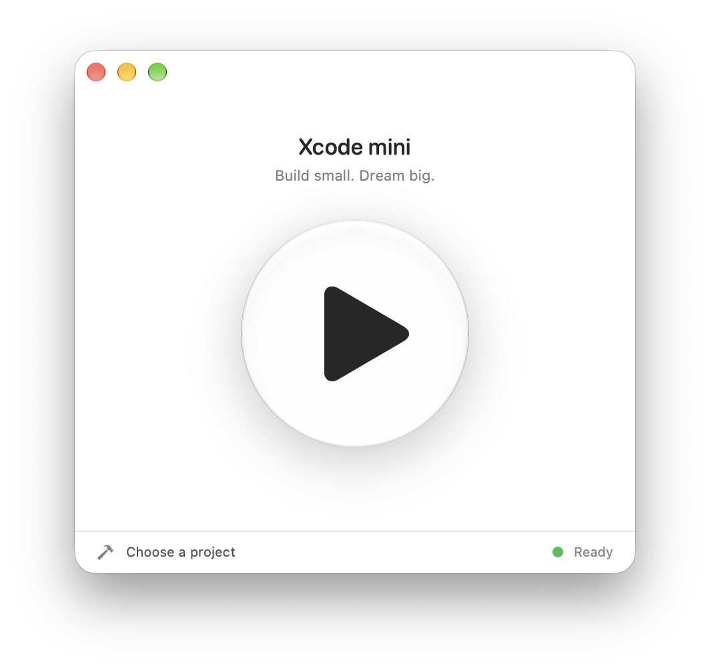

# Xcode mini



In the AI era, who needs a cockpit-sized IDE? Pick a project, press the one big
button, and let your AI agent and Xcode do the heavy lifting. Fewer panels, more
Play.

A small macOS front end for the Xcode 27 MCP server. Open an `.xcodeproj` or
`.xcworkspace`, or drop one project folder onto the window, then press Play.
Xcode Mini calls `XcodeOpenWorkspace`, `RunProject`, and `StopProject` through
Apple's `xcrun mcpbridge`; it does not invoke `xcodebuild` itself.

## Requirements

- macOS 15 or later on Apple silicon
- Xcode 27 selected with `xcode-select`
- Xcode 27 headless MCP service enabled by an administrator:

  ```sh
  sudo xcrun mcp-server enable
  ```

The MCP service can ask you to approve Xcode Mini and the selected project the
first time they connect. Leave `--unsafe-always-allow-all-agents` disabled.

## Build

```sh
xcodegen generate
xcodebuild -project 'Xcode mini.xcodeproj' -scheme 'Xcode mini' -destination 'platform=macOS' build
```

## Release 0.1.1

Download the notarized `XcodeMini-0.1.1-macos-notarized.zip` from the [v0.1.1 GitHub release](https://github.com/SoundBlaster/XcodeMini/releases/tag/v0.1.1), unzip it, and move `Xcode mini.app` to Applications.

## Developer ID release

The Release configuration uses Developer ID Application signing with Hardened Runtime. To archive, export, notarize, staple, and package a release ZIP on the Mac, install a Developer ID Application certificate for team `P8T2366K8X` and use an App Store Connect Team API profile authorized for notarization:

```sh
ASC_PROFILE="Agent Session Monitor" ./Scripts/release-macos.sh
```

The script writes the notarized ZIP under `build/`. It does not upload or publish a GitHub release.
